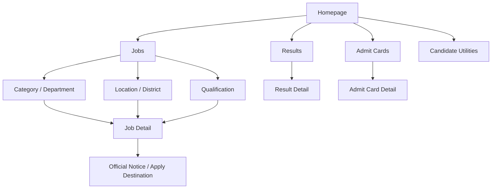

# Website Architecture

## Architecture principle

Use a shallow, task-first information system. A candidate should reach a relevant active opportunity, official source, result, or admit card in no more than three meaningful interactions from a major hub.

## Target page hierarchy

```text
Homepage (/)
├── Jobs hub (/jobs)
│   ├── Job detail (/jobs/{job-slug})
│   ├── Category / department discovery
│   ├── Qualification discovery
│   ├── Location and district discovery
│   └── Approved cross-filter landing pages
├── Results (/results) → result detail
├── Admit Cards (/admit-cards) → admit-card detail
├── Exam Calendar (/exam-calendar)
├── Current Affairs (/current-affairs)
├── Eligibility Checker (/eligibility-checker)
├── Study Material (/study-material)
├── News / guides (when editorially distinct)
└── Trust pages: About, Contact, Editorial Policy, Privacy, Terms, Disclaimer
```

## Navigation

Header: logo/home, Jobs, Results, Admit Cards, Exam Calendar, Study Material, and search. Keep category and district discovery inside Jobs rather than overcrowding the global header.

Footer: quick links, Maharashtra districts, high-demand categories/departments, candidate utilities, trust/legal pages, and sitemap.

Breadcrumbs must mirror the canonical hierarchy and be visible on detail and hub pages.

## Internal-linking rules

- Every job detail links to its jobs hub, relevant category/department, district or state where applicable, qualification hub where applicable, and official source.
- Every hub links to current, relevant detail pages; do not create long lists of expired or unrelated links.
- Results and admit-card pages link to the related exam and useful active opportunities when relevant.
- No indexable page may be orphaned.


