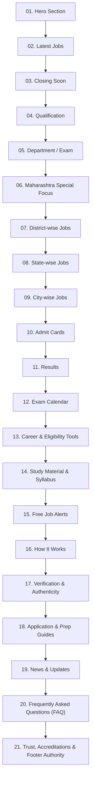

# SearchSarkariNaukri — Homepage On-Page SEO & Information Architecture

This document defines the sequential flow, section hierarchy, and folder structure for the **SearchSarkariNaukri Homepage On-Page SEO** implementation.

---

## 🧭 Homepage Section Flow & Architecture

The homepage is organized into **21 sequentially ordered sections** designed for maximum SEO performance, clear user search intent fulfillment, and high conversion:

---

## 📁 21-Section Specification Directory & Status

| # | Folder | Primary Specification File | Status |
|---|---|---|---|
| **01** | [`01_Hero/`](./01_Hero/) | [`herosection.md`](./01_Hero/herosection.md) & [`Live_Statistics/`](./01_Hero/Live_Statistics/homepage-live-statistics-db.md) | ✅ Complete |
| **02** | [`02_Latest_Jobs/`](./02_Latest_Jobs/) | [`02_Latest_Government_Jobs.md`](./02_Latest_Jobs/02_Latest_Government_Jobs.md) & [HTML](./02_Latest_Jobs/02_Latest_Government_Jobs.html) | ✅ Complete |
| **03** | [`03_Closing_Soon/`](./03_Closing_Soon/) | [`03_Closing_Soon.md`](./03_Closing_Soon/03_Closing_Soon.md) | ✅ Complete |
| **04** | [`04_Qualification/`](./04_Qualification/) | [`homepage-government-jobs-by-qualification-seo.md`](./04_Qualification/homepage-government-jobs-by-qualification-seo.md) | ✅ Complete |
| **05** | [`05_Department_Exam/`](./05_Department_Exam/) | [`05_Department_Exam.md`](./05_Department_Exam/05_Department_Exam.md) | ✅ Complete |
| **06** | [`06_Maharashtra/`](./06_Maharashtra/) | [`06_Maharashtra.md`](./06_Maharashtra/06_Maharashtra.md) | ✅ Complete |
| **07** | [`07_District/`](./07_District/) | [`07_District.md`](./07_District/07_District.md) | ✅ Complete |
| **08** | [`08_State/`](./08_State/) | [`08_State.md`](./08_State/08_State.md) | ✅ Complete |
| **09** | [`09_City/`](./09_City/) | [`09_City.md`](./09_City/09_City.md) | ✅ Complete |
| **10** | [`10_Admit_Cards/`](./10_Admit_Cards/) | [`10_Admit_Cards.md`](./10_Admit_Cards/10_Admit_Cards.md) | ✅ Complete |
| **11** | [`11_Results/`](./11_Results/) | [`11_Results.md`](./11_Results/11_Results.md) | ✅ Complete |
| **12** | [`12_Exam_Calendar/`](./12_Exam_Calendar/) | [`12_Exam_Calendar.md`](./12_Exam_Calendar/12_Exam_Calendar.md) | ✅ Complete |
| **13** | [`13_Tools/`](./13_Tools/) | [`13_Tools.md`](./13_Tools/13_Tools.md) | ✅ Complete |
| **14** | [`14_Study_Material/`](./14_Study_Material/) | [`14_Study_Material.md`](./14_Study_Material/14_Study_Material.md) | ✅ Complete |
| **15** | [`15_Alerts/`](./15_Alerts/) | [`15_Alerts.md`](./15_Alerts/15_Alerts.md) | ✅ Complete |
| **16** | [`16_How_It_Works/`](./16_How_It_Works/) | [`16_How_It_Works.md`](./16_How_It_Works/16_How_It_Works.md) | ✅ Complete |
| **17** | [`17_Verification/`](./17_Verification/) | [`17_Verification.md`](./17_Verification/17_Verification.md) | ✅ Complete |
| **18** | [`18_Guide/`](./18_Guide/) | [`18_Guide.md`](./18_Guide/18_Guide.md) | ✅ Complete |
| **19** | [`19_News/`](./19_News/) | [`19_News.md`](./19_News/19_News.md) | ✅ Complete |
| **20** | [`20_FAQ/`](./20_FAQ/) | [`20_FAQ.md`](./20_FAQ/20_FAQ.md) | ✅ Complete |
| **21** | [`21_Trust/`](./21_Trust/) | [`21_Trust.md`](./21_Trust/21_Trust.md) | ✅ Complete |
